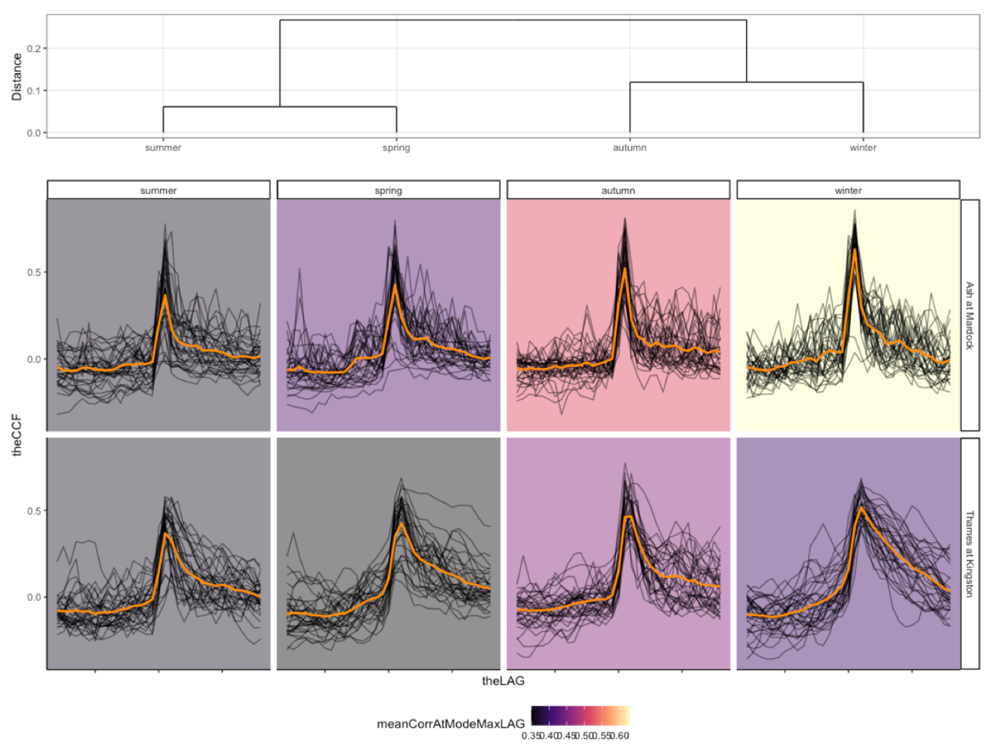
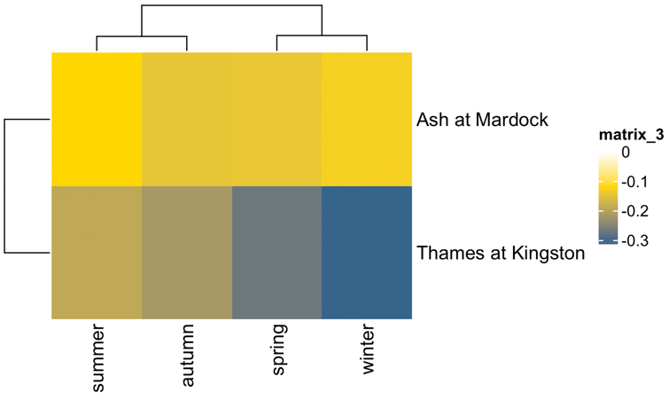
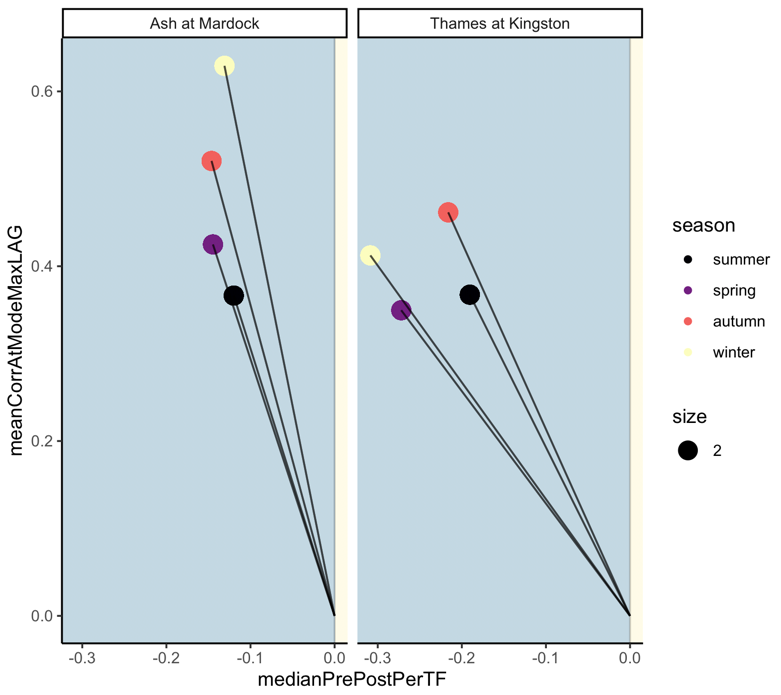

README
================
LGD
19/12/2021  

 <!-- badges: start -->
[](https://www.repostatus.org/#active)

  [](https://app.codecov.io/gh/somaSystems/lifeTimes?branch=main)
  <!-- badges: end -->

## lifeTimes: correlations in biological series data

This is a package for **detecting** and **visualising** correlations between objects in biological series data.

## Citation

**lifeTimes** is available for everyone. If you find it useful for your research please cite the work that motivated its development: **Environmentally dependent and independent control of cell shape determination by Rho GTPase regulators in melanoma.** doi: <https://doi.org/10.1101/2021.10.11.463377>

## **Quick start**

Download the code for lifeTimes and run these commands to try the workflow on a built-in dataset

``` r
# Extract and unzip the code
# navigate into the top level directory 
# run installation:
install()
#copy and paste to run on test data
lts <- lts_input() #calculate cross correlation
lts_clusterPlot(lts) #plot clustered correlations
lts_leadLagClusterPlot(lts) #plot direction of correlations
lts_couplingPlot(lts) # plot strength and direction of correlation
```

## **How to use**

To calculate cross correlation, just load the package, assign, and call the `lts <- lts_input()` function. This will chain together the lifeTimes workflow on a built in set of default data and return calculated cross correlations.
<p>
To plot cross correlations, just call `clusterPlot(lts)`.

To change the plot style just adjust the `plotType` argument. The options are `c( "compoundPlot", "draw_treatmentDendrogram", "plt_dendr", "heatmapLagZero", "rawTraces", "clusteredLines")`. For example, `clusterPlot(ltc, plotType = "rawTraces")`

<p>
To plot clustered lead vs lag metrics which emphasise the direction of coupling, just call `leadLagClusterPlot(lts)`.

<p>
Finally, to plot coupling plots, incorporating both strength and direction of coupling, just call `couplingPlot(lts)`.

## **Examples**

Example data are yearly cross correlation functions (CCFs) of rainfall and river flow rates for two different rivers in the United Kingdom, the Ash and Thames rivers. CCFs are calculated and plotted separately based on two explanatory variables, season (summer, autumn, winter, spring), and catchment region (Mardock, Kingston).

**Fig 1** Calculated cross correlations clustered by strength at lag zero

<p>

<p>
<p>
**Fig 2** Calculated asymmetries between past and future lags, clustered by strength of asymmetry

<p>


<p>
<p>
**Fig 3** 'Coupling plots' representing the strength of correlation at lag zero, and the direction of correlation.

<p>


**Fig 4** Ariel images of the Ash, and Thames rivers.


## **Inputs**

1.  Evenly spaced series data (eg. can be time or space series)

2.  Label of the measurements taken. (eg. can be shape or signal intensity)

3.  Labels for the objects to be compared (eg. cytoplasm and nuclear compartments)

4.  Higher level groupings for comparing objects (eg. compare objects per cell/organism/treatment/community)

## **Outputs**

1.  Calculated correlations clustered by strength at lag zero  

2.  Calculated asymmetries between past and future lags, clustered by strength of asymmetry  

3.  'Coupling plots' representing the strength of correlation at lag zero, and the direction of correlation  

© 2022 GitHub, Inc. Terms Privacy Security Status
