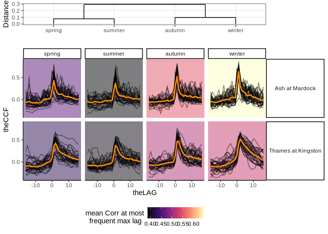
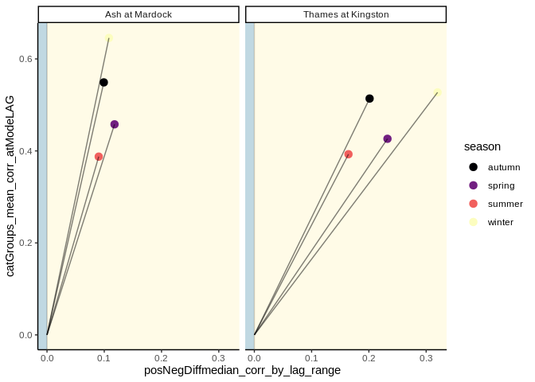
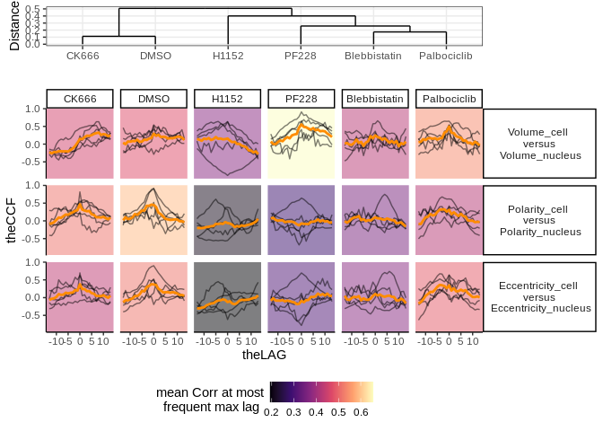
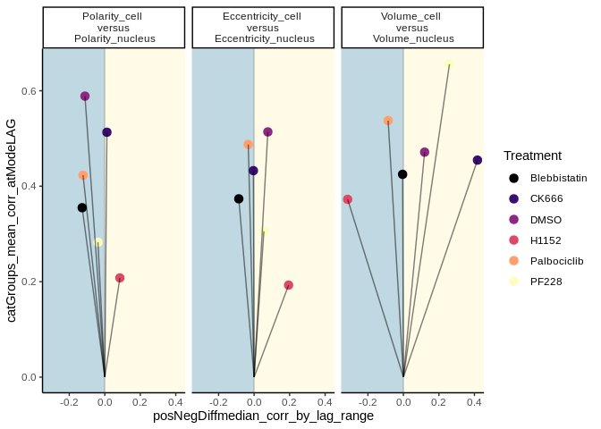
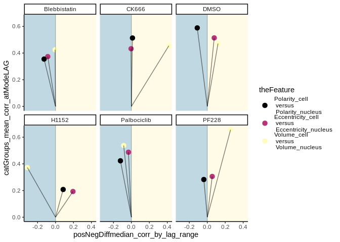

README
================
LGD
17/12/2021

-   [**Quick start**](#quick-start)
-   [**Detailed examples**](#detailed-examples)
-   [**Dataset 1: Rainfall and river
    flow**](#dataset-1-rainfall-and-river-flow)
    -   [**Two categorical variable with single pair of measured
        variables**](#two-categorical-variable-with-single-pair-of-measured-variables)
-   [**Dataset 2: Cell and nucleus**](#dataset-2-cell-and-nucleus)
    -   [**Single categorical variable with multiple measured
        variables**](#single-categorical-variable-with-multiple-measured-variables)
-   [**Downstream analysis: Rainfall and river
    flow**](#downstream-analysis-rainfall-and-river-flow)
    -   [**Output summary statistics**](#output-summary-statistics)
    -   [**Visualising principal component
        space**](#visualising-principal-component-space)
    -   [**Using PLSR to predict catchment
        location**](#using-plsr-to-predict-catchment-location)

[](https://www.repostatus.org/#active)

[](https://codecov.io/gh/somaSystems/lifeTimes)

[](https://github.com/somaSystems/lifeTimes/actions/workflows/test-coverage.yaml)
<p>


This is a package for **detecting** and **visualising** correlations
between objects in biological series data.

**Citation**

**lifeTimes** is available for everyone. If you find it useful for your
research please cite the work that motivated its development:
**Environmentally dependent and independent control of cell shape
determination by Rho GTPase regulators in melanoma.** doi:
<https://doi.org/10.1101/2021.10.11.463377>

## **Quick start**

[Back to top](#)

**Install lifeTimes**

``` r
#install devtools if needed
if(!require("devtools")) install.packages("devtools")

#load devtools
library(devtools)

#install dependency from github
if(!require("ComplexHeatmap")) install_github("jokergoo/ComplexHeatmap")

#install lifeTimes from github
install_github("somaSystems/lifeTimes")
```

**Run lifeTimes on default data**

``` r
#copy and paste to run on test data
library(lifeTimes)

lts <- lts_in() #calculate cross correlation
```

**Visualise results from lifeTimes on default data**

``` r
lts_plot_ccfs(lts) #plot clustered correlations
```

<!-- -->

``` r
lts_plot_ClustSum(lts) #plot direction of correlations
```

<!-- -->

``` r
lts_plot_coupled(lts) # plot strength and direction of correlation
```

<!-- -->

**Fig 1** Ariel images of the Ash, and Thames rivers.

<figure>
<figcaption aria-hidden="true"><strong>Fig 1:</strong> Ariel images of the Ash, and Thames rivers</figcaption>
</figure>

**Quick summary on inputs**  
i. Evenly spaced series data (eg. can be time or space series)  
ii. Label of the measurements taken. (eg. can be shape or signal
intensity)  
iii. Labels for the objects to be compared (eg. cytoplasm and nuclear
compartments)  
iv. Higher level groupings for comparing objects (eg. compare objects
per cell/organism/treatment/community)

**Quick notes on outputs**  
i. Plots of calculated correlations clustered by strength at lag zero  
ii. Plots of calculated asymmetries between past and future lags,
clustered by strength of asymmetry  
iii. Plots representing both the strength of correlation at lag zero,
and the direction of correlation  
iv. Calculated summary statistics of CCFs that can be used in downstream
analysis (e.g to improve the performance of classification tasks)

## **Detailed examples**

**description of default data** lifeTimes makes it easy to detect
“coupling” between different components of biological systems from the
scale of cells, to organisms, to ecosystems. Along these lines,
lifeTimes comes with examples of:  
i.landscape scale datasets, ii.subcellular scale datasets.

## **Dataset 1: Rainfall and river flow**

[Back to top](#)

**Landscape scale data** lifeTimes can be used to find coupling between
processes at the landscape or ecosystem scale. For this example, I have
used data from the United Kingdom, National River Flow Archive
(<https://nrfa.ceh.ac.uk/web-download-service>). We will look at two
types of data, i) Gauged Daily Flows (GDF) which measure how much water
is in a river, and ii) Catchment Daily Rainfall (CDR) which measure the
amount of rain on the landscape around the river. River flows are in
cubic meters per second, and rainfall is in mm across the catchment in
the given reference period
(<https://nrfa.ceh.ac.uk/data-formats-types>).  
<p>
For this example I have downloaded data from the Thames river, at
Kingston (<https://nrfa.ceh.ac.uk/data/station/info/39001>), and the Ash
river, at Mardock <https://nrfa.ceh.ac.uk/data/station/info/38002>. I
have also subset the data between the years 1983 and 2017. This is a
period where both stations were operating, and recording measurements.  
<p>

After some data wrangling, these two datsets produce a csv which I read
into a dataframe. You can [download a version of the dataframe
here](https://github.com/somaSystems/lifeTimes/blob/main/data-raw/rain_flow_Thames_Ash.csv).
The first five observations look like this:

``` r
rain_flow <- read.csv(file ="data-raw/rain_flow_Thames_Ash.csv")
head(rain_flow)
```

    ##         date dateAsInteger catchmentRegion flow_m3s rainfall_cm year month day
    ## 1 1983-06-01          4899  Ash at Mardock    4.720           3 1983     6   1
    ## 2 1983-06-02          4900  Ash at Mardock    0.756          12 1983     6   2
    ## 3 1983-06-03          4901  Ash at Mardock    0.543           8 1983     6   3
    ## 4 1983-06-04          4902  Ash at Mardock    0.450           0 1983     6   4
    ## 5 1983-06-05          4903  Ash at Mardock    0.392           0 1983     6   5
    ## 6 1983-06-06          4904  Ash at Mardock    0.363           0 1983     6   6
    ##   yearNumber dayNumber Reset_SeasonYearDay dayOfYear season dayOfseason
    ## 1          1       365                   0         0 summer           0
    ## 2          1       366                   1         1 summer           1
    ## 3          1       367                   2         2 summer           2
    ## 4          1       368                   3         3 summer           3
    ## 5          1       369                   4         4 summer           4
    ## 6          1       370                   5         5 summer           5
    ##                catchRep              uniqueID key_num
    ## 1 year_1_Ash at Mardock 1Ash at Mardocksummer  key_83
    ## 2 year_1_Ash at Mardock 1Ash at Mardocksummer  key_83
    ## 3 year_1_Ash at Mardock 1Ash at Mardocksummer  key_83
    ## 4 year_1_Ash at Mardock 1Ash at Mardocksummer  key_83
    ## 5 year_1_Ash at Mardock 1Ash at Mardocksummer  key_83
    ## 6 year_1_Ash at Mardock 1Ash at Mardocksummer  key_83

Plotting the river flow and rainfall measures over a 1000 day interval
looks like this:


The main funtion for user input in lifeTimes is `lts_in()`. To test that
lifeTimes is working you can run this function without any arguments.
This will run the program on a default set of data.However, it is more
interesting to run lifeTimes on your own data. Below, I have included a
worked example of how to use run lifeTimes on a dataset. For this
example, I am still usingthe rain\_flow dataset, except that the steps
to run this data in `lts_in()` are now clearly shown.

**Example 1**

``` r
library(lifeTimes) #load lifeTimes namespace

#use the lts_pairsMaker hrlper function 
#to prepare variables to be compared in a list of lists format 
lts_pairedVars <- lts_pairsMaker(c("rainfall_cm","flow_m3s"))
lts_pairedVars
```

    ## $rainfall_cm
    ## $rainfall_cm[[1]]
    ## [1] "rainfall_cm"
    ## 
    ## $rainfall_cm[[2]]
    ## [1] "flow_m3s"

### **Two categorical variable with single pair of measured variables**

[Back to top](#)

``` r
#arguments for lts_in() with default inputs (the "river catchments "rain_flow" dataset) shown
lts_in(.in_tsData = rain_flow  , #1. the dataset
         .in_time = c("dayOfseason"), #2. the time column
       .in_compare_categorical =  c("season", "catchmentRegion"), #3. A vector, with the names of categorical columns
       .in_plot_measured_variables = FALSE , #4. Whether to CCFs for multiple pairs of variables 
       .in_pairedComparisons =  list(pair_1 = list(y = "rainfall_cm", 
        x = "flow_m3s")), #5. A list of lisys, holding the pairs of variables to be compared
       .in_uniqueID_colname = "key_num", #6. The column with unique ID name for your observations
       .in_metaData = NULL) #7. Column names of any attributes you would like to append to data
```

<p>

I will now give a walkthrough that explains the arguments above, and how
to run lifeTimes, on your own data! To make any data suitable for
lifeTimes, we need the raw data, and four types labels which identify
the “time”,“unique ID”, “categorical variable” and “measured variable”
columns. There is also an option to identify metadata:

**The Arguments**

**1:`.in_tsData =` A series dataframe:** Time series measurements. These
should have:  
i. at least two variables,  
ii. evenly spaced intervals,  
iii. Complete sets of observations (e.g NAs, can be imputed).  
iv. Time series of equal length.  
v. At least two categorical variables (e.g Treatment vs Control)

TODO: lifeTimes will be compatible with orical variable, and missing
observations. A helper function to impute NAs will also be included.

**2: `.in_time =` A unit of time:** So we need to find the column in the
dataset that indicates this. In this data we have years, months and
days, but the unit of time I am interested in is at the resolution of
days. The column in the datset with days is called `"dayOfseason"`. On
the first day of each season (summer, autumn, winter, spring) this value
starts at one and increments up until the end of the season.

**3: `.in_compare_categorical =` Categorical Variables:** This is where
you tell lifeTimes which colums hold the labels for categorical
variables. For example these might be experimental treatments or
conditions. Currently you can have 1 or 2 categorical variables. For the
rainflow dataset there are 2 columns with categorical variables, and
they are “season” (e.g a label that is ‘summer’, ‘autumn’, ‘winter’ or
‘spring’) and “catchmentRegion” e.g “Ash at Mardock” or “Thames at
Kingston”. LifeTimes will cluster your categorical data based on
correlations between measured variables.

**4: `.in_plot_measured_variables =` Whether to plot multiple
variables?** This parameter takes a logical argument and can be either
“TRUE” or “FALSE”. The choice depends on whether you are analysing two
categorical variables, in which case set it to “FALSE”. If you are
studying one categorical variable but would like to calculate and plot
the cross correlations of multiple mesured variables, set this to
“TRUE”. A detailed explanation is below.  
<p>
Currently in lifeTimes, categorical and measured variables can be used
in two ways:  
<p>

1.  You can analyse 2 categorical variables and one pair of measured
    variables. This is shown with the “rain\_flow” dataset. The two
    categorical variables are “catchment” and “season”, and the pair of
    measured variables are “rainfall\_cm” and “flow\_m3s”.  
2.  alternatively, if you are using one categorical variable, but more
    than one pair of measured variablesyou can set this to
    `.in_plot_measured_variables = TRUE`

**5: `.in_pairedComparisons =` Pairs of variables to compare to one
another at different lags:** Under the hood, these are passed to the
lifeTimes internal functions in the format of a list of lists. There is
one master list, holding lists of paired variables to compare. In
practice, there is a helper fuction `lts_pairsMaker()`, that takes a
vector with a list of column names, and returns all possible non
redundant pairs of variables in this list. So you can give a list of
variables you would like to compare to the `lts_pairsMaker` function,
and assign the output to an object. Then just pass this object as an
argument to the `.in_pairedComparisons =` parameter (See example 1
above). In addition to iterating all possible combinations of pairings
between variables, lts\_pairsMaker can be passed a table of
pre-specified pairings, and return these in list of list format (this is
demonstrated in the examples below).

**6:`.in_uniqueID_colname =` A unique identified for each thing we are
measuring:** We need to give lifeTimes the column namr which holds the
unique identifier for each observation. If there isn,t one, we can
create a column in the data frame with unique identifier for each
observation.  
<p>
In this dataset the column is called “key\_num”. In general, an unit of
observation is some unit of interest, measured over time. In this
dataset, it’s a river measuring station, in a given season, in a given
year. For example, “Ash river in summer in 1995”, or “Thames river in
winter of 2001”. So in this dataset I have grouped the data by,
River,Season and Year, and given a unique ID to each observation and
labelled the column `"key_num"`.  
<p>

TODO: Future updates to lifetimes will include a helper function that
inputs a set of columns defining a unique observation, and outputs
creates a new column of uniqueIDs.

**7: `.in_metaData =` Column names of metadata:** This parameter takes
column names of any attributes you would like to append to data

## **Dataset 2: Cell and nucleus**

[Back to top](#)

**Subcellular scale data** We have seen that lifeTimes can be used to
detect the coupling between lanscape scale processes such as rainfall
and riverflow, and to highlight how this coupling varies between seasons
and geographical regions. In this next example, I am using lifeTimes to
look at coupling between the overall geometry of a living cell, and the
nucleus compartment within that cell. For this example I have used data
from melanoma cells imaged in a 3D collagen matrix, treated with
different drugs that affect cell function. The data here are just 30
cells (5 cells for each drug treatment), sampled for demonstration
purposes, from a larger dataset.  
<p>

First I read in the ‘sampleCells.csv’ data, that is included in the
lifeTimes package.

``` r
###start example
lts_cells <- read.csv(file = "data-raw/sampleCells.csv")
```

<p>

Next, I look at the column names to see the categorical variables, and
measured variables in the dataset

``` r
#look at colum names
colnames(lts_cells)
```

    ##  [1] "Volume_cell"                "EquivDiameter"             
    ##  [3] "SurfaceArea_cell"           "MeanIntensity"             
    ##  [5] "MinIntensity"               "MaxIntensity"              
    ##  [7] "MajorAxis_cell"             "MinorAxis_cell"            
    ##  [9] "secondMajor_cell"           "Eccentricity_cell"         
    ## [11] "secondEccentricity_cell"    "Sphericity_cell"           
    ## [13] "Vol2surf_cell"              "runNumber"                 
    ## [15] "timeTrack"                  "yDim"                      
    ## [17] "xDim"                       "zDim"                      
    ## [19] "xCoord_cell"                "yCoord_cell"               
    ## [21] "zCoord_cell"                "Orbit"                     
    ## [23] "AngleBetween"               "serialNumber"              
    ## [25] "nProtrusions_cell"          "CoverslipPresent"          
    ## [27] "CoverslipDistance"          "OnCoverslip"               
    ## [29] "fieldNumber"                "Treatment"                 
    ## [31] "Row"                        "Column"                    
    ## [33] "Polarity_cell"              "Spreading_cell"            
    ## [35] "Protrusivity_cell"          "cellNumber"                
    ## [37] "NucleusVolumeFraction"      "Volume_nucleus"            
    ## [39] "SurfaceArea_nucleus"        "MajorAxis_nucleus"         
    ## [41] "MinorAxis_nucleus"          "secondMajor_nucleus"       
    ## [43] "Eccentricity_nucleus"       "secondEccentricity_nucleus"
    ## [45] "Sphericity_nucleus"         "Vol2surf_nucleus"          
    ## [47] "xCoord_nucleus"             "yCoord_nucleus"            
    ## [49] "zCoord_nucleus"             "nProtrusions_nucleus"      
    ## [51] "Polarity_nucleus"           "Spreading_nucleus"         
    ## [53] "Protrusivity_nucleus"       "Plate"                     
    ## [55] "cluster"

Here, I can see that `"runNumber"`, will be the column with the time
information, and `"cellNumber"` will be the unique ID for each
observation. `"Treatment"` is a categorical variable.
<p>
For this dataset, I am only interested in one categorical variable,
called “Treatment”. This variable describes the drug that each cell has
been exposed to. This is in contrast to the “rain\_flow” dataset
(example 1 above) where there were two categorical variables of inerest
(“season” and “catchmentRegion”).  
<p>
Also, I can see that there are many measured variables for both the cell
and nucleus that I could compare (eg. “Polarity\_cell”,
“Eccentricity\_nucleus”, “Volume\_cell” etc.) . This is in contrast to
the “rain\_flow” dataset where there were only two measured variables.  
<p>

**User defined paired comparisons** For this dataset, instead of using
`lts_pairsMaker` to permute all the possible comparisons between
measured variables, I will specifically define the variables to compare.
In the cell dataset, we can use some domain specific knowledge to
recognise that comparing the coupling of geometry between the cell and
nucleus under different drug treatments is meaningful and interesting.
To make this comparisons, I have just listed some of the features I
would like to directly compare, and then joined this into a matrix that
I named `my_pairs` by using `rbind()`:

``` r
#choose three pairs of column names
pair1 <- c("Polarity_cell","Polarity_nucleus")
pair2 <- c("Eccentricity_cell", "Eccentricity_nucleus")
pair3 <- c("Volume_cell", "Volume_nucleus")

# use rbind to make these pairs into a matrix
my_pairs <- rbind(pair1,pair2,pair3)
```

<p>

I passed `my_pairs` to `lts_pairsMaker` with `defined = TRUE`, to create
a list of specific paired comparisons that I would like to make. This
contrasts with the less default use of `lts_pairsMaker`, where a list of
column names is entered, and all possible non-redundant combinations of
these are returned.

``` r
#make these into list of pairs using helper function with "defined = TRUE"
lts_pairs <- lts_pairsMaker(my_pairs, defined = TRUE)
```

<p>

### **Single categorical variable with multiple measured variables**

[Back to top](#)

The data, relevant column names and list of pairs can all be entered
into `lts_in()`. The important and interesting difference between this
example and the “rain\_flow” example, is that we are now using a
**single categorical variable**, “Treatment”. In this situation you must
set `.in_plot_measured_variables = TRUE`. This means lifeTimes will
cluster and plot the different measured variables.  
<p>

TODO: Improve UI by either removing `.in_plot_measured_variables = TRUE`
argument, and making it automatic when only one categorical is entered,
OR make it possible to enter only one categorical, while
`.in_plot_measured_variables = FALSE`.

``` r
# enter arguments into lts_in
# here there is one categorical variable and multiple measured variables
lts_oneCat <- lts_in(.in_tsData = lts_cells,
                     .in_compare_categorical = "Treatment",
                     .in_time = "runNumber",
                     .in_plot_measured_variables = TRUE,
                     .in_pairedComparisons = lts_pairs,
                     .in_uniqueID_colname = "cellNumber",
                     .in_metaData = NULL )
```

<p>

After running `lts_in()`, the output can be plotted with the three
lifeTimes plotting functions. Examples are below:

``` r
#View results
lts_plot_ccfs(lts_oneCat)
```

<!-- -->

``` r
lts_plot_ClustSum(lts_oneCat)
```

<!-- -->
<p>

This example of `lts_plot_coupled()` shows two plots of the same data,
and how the colouring and faceting variables can be switched with the
`.lts_colour_by =` and \`.lts\_facet\_by =\`\`\` parameters.

``` r
lts_plot_coupled(lts_oneCat, 
                 .lts_colour_by = "cat1", 
                 .lts_facet_by = "cat2")
```

<!-- -->

``` r
lts_plot_coupled(lts_oneCat, 
                 .lts_colour_by = "cat2", 
                 .lts_facet_by = "cat1")
```

<!-- -->

## **Downstream analysis: Rainfall and river flow**

[Back to top](#)

Cross correlations, or lagged correlations between features have many
uses. Two of these are:  
i. generating hypotheses about cause and effect between parts of a
system  
ii. improving the results of classification tasks indynamic datasets  
<p>

The code below shows how you can access summary statistics about each
ovbservation, for use in downstream tasks.

``` r
#load lideTimes
library(lifeTimes)

#run lifeTimes
lts_demo <- lts_in()
```

### **Output summary statistics**

[Back to top](#)

lifeTimes outputs a range of ccf summary statistics. These are stored in
a list called “lts\_ccf\_summaries”.

``` r
#Here is an example of accessing one set of summary statistics
#and assigning it to an object
lts_summary_output <- lts_demo$lts_ccf_summaries$lts_singleton_summ_metadata
```

**summary cleaning functions** lifeTimes has a built in function
`lts_summs_clean()`, to clean summary statistics for downstream
analysis. This function just takes the output of the `lts_in()`
function.

``` r
#Just enter the output from lts_in(), into the lts_summs_clean() function
lts_clean_demo <- lts_summs_clean(lts_demo)
```

This attaches a list called `"lts_clean_summs"` to the `lts_in()`
output, which contains:

1.  summary statistics of original time series input, called
    `lts_clean_summ_original`

2.  summary statistics of ccf calculations, called `lts_clean_summ_ccf`

3.  a join of both (i) and (ii), to give combined summary statistics,
    `lts_clean_summ_join`  

    <p>

    This new list can be passed to `lts_prcomp()`, to generate principle
    components.

``` r
#Use lapply to iterate over "lts_clean_summs", to generate principle components
lts_pc_list <- lapply(lts_clean_demo$lts_clean_summs, lts_prcomp) #run pc analyis on each
```

### **Visualising principal component space**

[Back to top](#)

Principle component space can be plotted for each of the three summary
statistics. First we install the needed packages. Then we assign labels,
and use lapply on our already computed principle components. This
generates a list of plots.

``` r
#install ggfortify if needed
if(!require("ggfortify")) install.packages("ggfortify")
```

    ## Loading required package: ggfortify

    ## Loading required package: ggplot2

``` r
library(ggfortify)

#make labels
lts_pca_labels <- lts_pc_list$lts_clean_summ_original$lts_labels_pc

#make 3 versions of PCA space
p <- lapply(lts_pc_list, function(x) autoplot(x$lts_pc_values, 
                                              data =lts_pca_labels,     
                                              colour = "catchmentRegion")+
  scale_color_manual(values = c("dodgerblue","darkorange"))+  theme_classic())
```

Principle component space can be plotted for each of the three summary
statistics:  
i. original data summaries

2.  calculated ccfs summaries

3.  combined data summaries

``` r
#plot PCA space
if(!require("gridExtra")) install.packages("gridExtra")
```

    ## Loading required package: gridExtra

``` r
library(gridExtra)
do.call("grid.arrange", p)
```

<!-- -->

In comparison to the original data, the combined dataset give improved
performance in classification tasks. Importantly, this improvement comes
from the same original data without the addition of any new variables or
measures. Instead, the improvement comes from the CCFs which give a
better account of the relationship or coupling between measured
variables and how these change between conditions.

### **Using PLSR to predict catchment location**

[Back to top](#)

We can look at performance in classification tasks using PLSR to predict
`catchmentRegion`, as a dummy variable. First we install and load the
“pls” package.

``` r
if(!require("pls")) install.packages("pls")
```

    ## Loading required package: pls

    ## 
    ## Attaching package: 'pls'

    ## The following object is masked from 'package:stats':
    ## 
    ##     loadings

``` r
library(pls)
```

<p>

**Original data summary stats**

From summary statistics of original data, CV analysis suggests 4 comps
be used. This gives prediction accuracy of `66.74`.

``` r
#get categorical variables and predictors
lts_PLSR <- lts_pc_list$lts_clean_summ_original

#Get column names of predictors
lts_predictors <- lts_PLSR$lts_values_pc
lts_response <- as.numeric(lts_PLSR$lts_labels_pc$catchmentRegion)
PLSR_model <- plsr(lts_response ~ ., data=lts_predictors, scale=TRUE, validation="CV")
```

**Plot RMSEP and prediction accuracy with Original Data**

``` r
plot(RMSEP(PLSR_model), legendpos = "topright")
```

<!-- -->

``` r
plot(PLSR_model)+abline(h =1.5, col = "magenta")
```

<!-- -->

    ## numeric(0)

<p>

**CCF + Original data summary stats**

From summary statistics of original and cross correlation data (CCF), CV
analysis suggests 8 comps be used. This gives prediction accuracy of
`75.35`.

``` r
#get categorical variables and predictors
lts_PLSR <- lts_pc_list$lts_clean_summ_join

#Get column names of predictors
lts_predictors <- lts_PLSR$lts_values_pc
lts_response <- as.numeric(lts_PLSR$lts_labels_pc$catchmentRegion)
PLSR_model <- plsr(lts_response ~ ., data=lts_predictors, scale=TRUE, validation="CV")
```

**Plot RMSEP and prediction accuracy with CCF Augmented Data**

``` r
plot(RMSEP(PLSR_model), legendpos = "topright")
```

<!-- -->

``` r
plot(PLSR_model)+abline(h =1.5, col = "magenta")
```

<!-- -->

    ## numeric(0)

In this simple example, using cross validated PLSR models, and selecting
the number of model components where RMSEP reaches the first turning
point, the improvement in prediction accuracy by incorporating CCF
summary statistics is `75.35 - 66.74 = 8.61`. This improvement comes
without adding any new measurements to the original data. The
improvement in prediction accuracy is likely to depend on whether there
are strong and characteristic difference in the relationships between
variables in your dataset, and whether these differ between conditions.

[Back to top](#)

© 2022 GitHub, Inc. Terms Privacy Security Status
