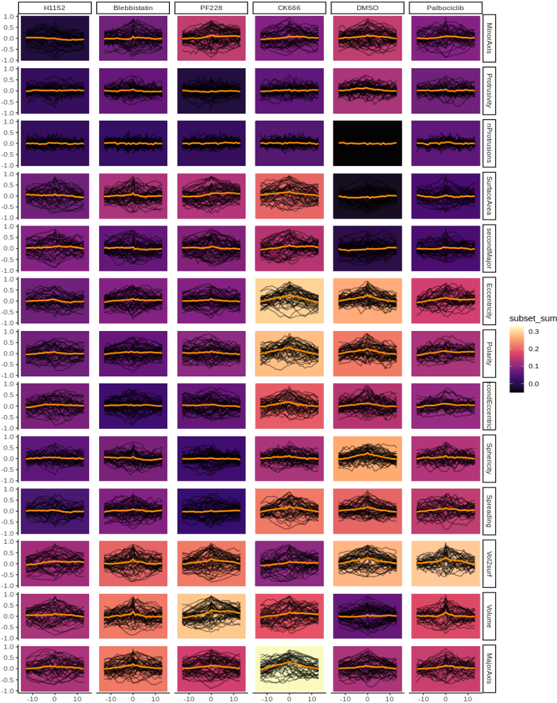
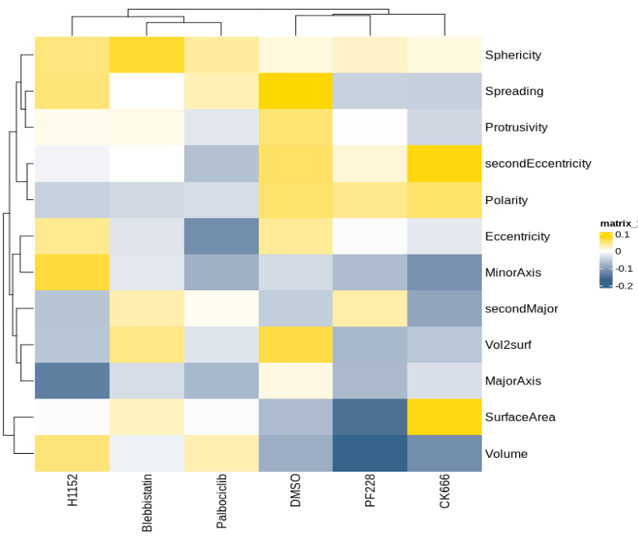
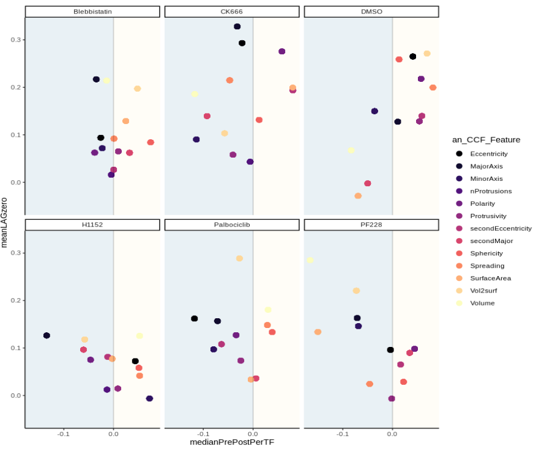

```{r setup, include=FALSE}
knitr::opts_chunk$set(echo = TRUE, fig.path = "README_figs/README-")
```

[](https://www.repostatus.org/#wip)


## lifeTimes: correlations in biological series data

This is a package for **detecting** and **visualising** correlations between objects in biological series data. 

Citation
--------

**lifeTimes** is available for everyone. If you find it useful for your research please be so kind as to cite the work that motivated its development: **Environmentally dependent and independent control of cell shape determination by Rho GTPase regulators in melanoma** doi: https://doi.org/10.1101/2021.10.11.463377

**How to use**\
--------
To calculate cross correlation, just load the package, assign, and call the  ``outputCCF <- lifeTimesChain()`` function. 
This will chain together the lifeTimes workflow on a built in set of default data and return calculated cross correlations.<br>
<p>
To plot cross correlations, just call ``clusterPlot(outputCCF)`` <br>
To change the plot style just adjust the ``plotType`` argument. <br>
For example, ``clusterPlot(outputCCF, plotType = "rawTraces")`` <br>

**Inputs**\
--------
i.      Evenly spaced series data (eg. can be time or space series)
ii.     Label of the measurements taken. (eg. can be shape or signal intensity)
iii.    Labels for the objects to be compared (eg. cytoplasm and nuclear compartments)
iv.     Higher level groupings for comparing objects (eg. compare objects per cell/organism/treatment/community)


**Outputs**\
--------
i.      Calculated correlations clustered by strength at lag zero\n
ii.     Calculated asymmetries between past and future lags, clustered by strength of asymmetry\n
iii.    'Coupling plots' representing the strength of correlation at lag zero, and the direction of correlation\n

**Examples**\
--------

**Fig 1** Calculated correlation clustered by strength at lag zero  

<p>
{width=50%}  

<p>
<p>

**Fig** 2Calculated asymmetries between past and future lags, clustered by strength of asymmetry  

<p> 
{width=50%}  

<p>
<p>

**Fig 3** 'Coupling plots' representing the strength of correlation at lag zero, and the direction of correlation.  

<p>
{width=50%}  


